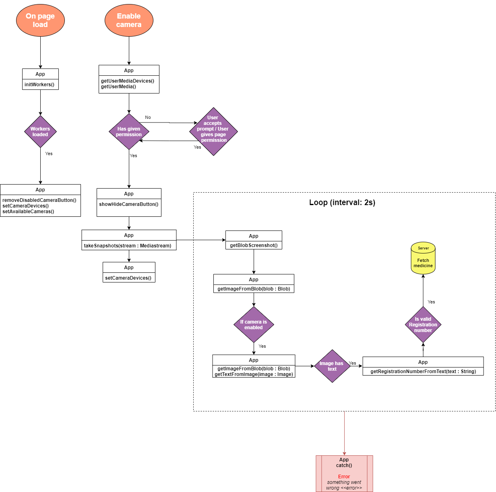

# Medicine Scanner

This project features a medicine scanner using Optical Character recognition (OCR). It is able to detect what kind of medicine you are holding using the device's camera.


## Demo

[Demo](https://medicijn-scanner.herokuapp.com/)

## Table of Contents

1. [How to install](#How-to-install)
2. [Debriefing](#debriefing)
3. [Design Rationale](#design-rationale)
4. [Onderzoeksvragen](#onderzoeksvragen)
    - [Scope](#scope)
    - [Planning](#planning)
    - [Use Case](#use-case)
    - [Interaction Diagram](#interaction-diagram)
5. [Vakcriteria](#vakcriteria)
    - [Web App From Scratch](#Web-App-From-Scratch)
    - [CSS To The Rescue](#CSS-To-The-Rescue)
    - [Progressive Web App](#Progressive-Web-App)
    - [Browser Technologies](#Browser-Technologies)
    - [Real Time Web](#Real-Time-Web)
    - [Web Design](#Web-Design)
6. [Licence](#licence)    

## How to install

**Step 1:** Clone project:
```git
git clone https://github.com/meessour/medicine-scanner.git
```

**Step 2:** CD to path of the project's root:
```git
cd C:/../..
```

**Step 3:** Install packages:
```git
npm install
```

**Step 4:** Start the server:
```git
npm start
```

**Step 5:** Navigate to: http://localhost:8080/

## Debriefing

Dit project wordt in opdracht uitgevoerd door bedrijf "Voorhoede" en heb daarbij veel vrijheid binnen een bepaalde scope. Voor dit project is het niet nodig om mij te verdiepen in dit bedrijf. Een bestaande collectie met verschillende medicijnen en de informatie die daar betrekking bij heeft, heb ik tot mijn beschikking. Informatie/data geleverd uit de app is op basis van [deze collectie/API](https://hva-cmd-meesterproef-ai.now.sh/medicines). Hier is een voorbeeld van een medicijn en de relevante informatie in JSON:

```json
{
  "id": 0,
  "registrationNumber": "RVG  121312",
  "name": "18F-FDG Hoboken 250 MBq/ml, oplossing voor injectie",
  "activeIngredient": "V09IX04 - Fludeoxyglucose [18 F]"
}
```

De opdrachtgever wilt een web app die bedoeld is voor medicijngebruikers, dat is de doelgroep. In deze app kunnen medicijndoosjes gescand worden met de camera van de gebruiker. Aan de hand daarvan lever ik een bijsluiter en andere belangrijke informatie aan de gebruiker op visuele wijze via een informatie-/resultatenpagina. De gebruiker scanned (bijvoorbeeld) het registratienummer en via OCR (Optical Character Recognition) en de app levert dan data op basis van dit nummer. Daarnaast moet frontend van deze site intuïtief en toegankelijk zijn en is bedoeld voor een brede doelgroep. In de app moeten onder andere de homepage, scanner pagina en resultaat pagina aanwezig zijn.

## Onderzoeksvragen

* Hoe kan een medicijngebruiker op basis van een medicijndoosje een bijsluiter en belangrijke informatie vergaren?
    * Wat zou de app moeten kunnen herkennen van een scan?
    * Wat is een alternatief als de gebruiker geen camera heeft?
    * Worden er geen regels overtreden van de GDPR?
    * Hoe gaat de app om met false-positives?
    * Hoe vangt de app errors op?
    * Wat doet de app als er geen resultaat uit een scan is voortgekomen?

### Scope
* Use the user's webcam
* Make it clear for the user what the webcam will be used for
* Let the user choose if they want to help improve the app by sending their scan results to the server.
* Let the user recover easily when something goes wrong.
* The app should work on different types of browsers.
* The app should handle if the user is offline/has no JS.

### Planning
**Week 1:** Oriënteren over opdracht en concept uitwerken.  
**Week 2:** De basis opzetten en benodigde functionaliteiten implementeren.  
**Week 3:** Opdracht verder uitwerken en extra features toevoegen.  
**Week 4:** Testen en verbeteren/perfectioneren.    
**Week 5:** Puntjes op de i zetten, bugs fixen en afronden. 

### Use Case

Here are a few use cases of a medicine user using the app:


### Interaction diagram

Here is the interaction diagram of this app:


## Vakcriteria

### Web App From Scratch

| Criteria | Hoe het wordt toegepast | Waarom
| --- | --- | --- |
| De code bevat geen syntaxfouten en is netjes opgemaakt | Bij elke promise een catch functie hebben en aangeven in de console.log voor welk proces de error relevant was. <br> <br>Duidelijke benamingen van functies, variabelen en klassen. Toelichting bij code die verwarrend kan zijn of complex is. Een referentie van mijn code geven als deze niet geschreven is door mij. | Dit is een criteria waar elke app standaard aan zou moeten voldoen. 
| JSON data kan met een asynchrone request worden opgehaald uit een API. <br> <br>JSON data kan, minimaal met de methodes; map, filter en reduce worden gemanipuleerd | Om de data afkomstig van de API te manipuleren heb ik een functie geschreven. Deze functie is zeer efficiënt en word in rap snelheid voltooid. Bij het manipuleren maak ik gebruik van onder andere .findIndex, arrowfuncties (om de code minimaal te houden en beter leesbaar te maken). Daarnaast maak ik gebruik van de key values van een JSON object om de READ snelheid te verhogen en bestandgrootte te verminderen. | Werken met data afkomstig van een API en deze op de server verwerken is zeer belangrijk. Denk hierbij aan hoe je bepaalde (ontbrekende) data afhandelt, hoe je op een strategische manier resources gebruikt, hoe je taken asynchroon kan maken om uiteindelijk alles zo snel en efficiënt mogelijk kan laten werken.
| De user flow en object / class flow zijn visueel gemaakt | Door middel van een interaction diagram elk proces te visualiseren. | Zo kan iemand die de app nog nooit gebruikt heeft een overzicht krijgen van hoe de app werkt.
| De interface bevat feedback naar de gebruiker op het moment dat er gewacht moet worden op het laden van data | Door middel van laad animaties en de gebruiker informeren welke taak verwerkt wordt en waar. | De gebruiker informeren over processen is voor meerdere redenen belangrijk, hier volgen een paar voorbeelden. De gebruiker is bereid om langere laadschermen sneller te accepteren/er mee om te gaan. De gebruiker legt meer vertrouwen in de app aangezien hij/zij weet wat er te allen tijde gaande is.

### CSS To The Rescue

| Criteria | Hoe het wordt toegepast | Waarom
| --- | --- | --- |
| You try to ignore the cascade, inheritance and specificity | Als een bepaalde styling niet ondersteund wordt in elke browser, kijk ik eerst of het probleem met -webkit opgelost kan worden en anders zorg ik voor een goede fallback. | Niet iedereen wil/is in staat om de meest recente browser te gebruiken, en hier moet rekening mee gehouden worden. Een web app moet door zo veel mogelijk mensen moeten kunnen worden gebruikt, niet alleen voor meer internetverkeer, maar ook om het web als geheel toegankelijk te houden. 
| Is interactivity enhanced within in given CSS scope? | Door de webpagina op een inclusieve manier te structureren, zorg ik er voor dat de app op meerdere apparaten/situaties correct kan werken. | Ongeveer hetzelfde principe als hierboven, de app kan op deze manier in veel meer verschillende situaties en apparaten werken.

### Progressive Web App

| Criteria | Hoe het wordt toegepast | Waarom
| --- | --- | --- |
| Je snapt het verschil tussen client side en server side renderen en kan server side rendering toepassen voor het tonen van data uit een API. | De app voert de OCR uit op de client om zo de server niet overbelast te laten raken. De server wordt verder alleen gebruikt om de API data te verwerken en READ requests te doen op deze data. | Met deze app maak ik gebruik van Heroku om de server draaiende te houden. Om Heroku niet overbelast te laten raken voer ik de zware OCR logica uit op de client. Op deze manier is de app niet afhankelijk van de hoeveelheid gebruikers op de site.
| Je snapt het verschil tussen client side en server side renderen en kan server side rendering toepassen voor het tonen van data uit een API. | Het doel van de app is om medicijnen in te laten scannen doormiddel van de camera en deze informatie ter beschikking stellen aan de gebruiker. Stel dat javascript niet werkt of de gebruiker geen camera heeft, is er altijd de optie om handmatig te zoeken naar een specifiek medicijn. | Ongeveer dezelfde principes als bij CSS to the rescue. De app hoort te werken in zo veel mogelijk verschillende situaties en daarvoor moet er een fallback aanwezig zijn.

### Browser Technologies

| Criteria | Hoe het wordt toegepast | Waarom
| --- | --- | --- |
| Student kan de core functionaliteit van een use case doorgronden.<br><br>In de README van het project staat een probleemdefinitie, hoe het probleem is opgelost en een uitleg van de code. | Verschillende scenario’s opstellen in de README en uitleg over de app. | Vooraf oriënteren waarom ik de app maak, voor wie en hoe ik van plan ben het te oriënteren. Daarnaast kan je op deze manier gebreken of nieuwe dingen ontdekken.
| Student laat zien hoe Progressive Enhancement toe te passen in Web Development. | In deze app pas ik dit toe door fallbacks te implementeren en rekening houden met verschillende (onverwachte) scenario’s. Om te voldoen aan het principe van Progressieve enhancement is de app in de 3 lagen opgebouwd. | Zie CSS tot he rescue en Progressive web app voor een uitgebreidere uitleg. 

### Real Time Web

| Criteria | Hoe het wordt toegepast | Waarom
| --- | --- | --- |
| Project | De app wordt gehost en geserved vanuit Heroku en is daardoor 24/7 online. In de documentatie staat uitgelegd wat het project inhoud en welke databron gebruikt wordt. | Verduidelijking voor mensen die onbekend zijn met mijn app/broncode.
| Complexiteit/ Client-server interactie | De app voert om de twee seconden een OCR scan uit en communiceert daarmee ook de hele tijd met de server. De app is constant processen aan het uitvoeren en te communiceren met de server. | Om zo de best mogelijk ervaring te creëren.
| Data management | Door middel van sockets, verschillende gebruikers onderscheiden van elkaar en er voor zorgen dat gebruikers geen invloed op elkaar hebben. | Privacy gevoeligheid en onafhankelijkheid. 

### Web Design

| Criteria | Hoe het wordt toegepast | Waarom
| --- | --- | --- |
| Readme: In de beschrijving van het project staat de opdracht uitgelegd, is het probleem duidelijk beschreven en hoe het probleem is opgelost. | Zie Browser technologies. | Zie Browser technologies.
| Privacy gevoeligheid en omgaan met gegevens van gebruikers. | De gebruiker kan als optionele optie de camera gebruiken om zo gemakkelijker de app te kunnen gebruiken. De gebruiker moet eerst zelf handmatig een knop indrukken voordat de camera aan gaat, dit is om de gebruiker in controle te laten en vertrouwen te creëren. Ook is er een informatie icoontje naast de Turn On Camera knop om de gebruiker meer uitleg te geven over wat er gedaan wordt met zijn/haar camera/gegevens.<br><br> In de app zelf wordt er geen data opgeslagen en blijft alle camera snapshots/data op de client zelf en wordt niet verzonden naar de server. Er worden alleen medicijn codes verstuurd naar de server die van te voren gefilterd worden op basis van een RegEx. Op deze manier kan er met zekerheid gezegd worden dat er niks met de gegevens gedaan wordt. | Al uitgelegd in de sectie hier links van, maar het komt neer op de gebruiker in controle laten en transparant zijn. Daarnaast wordt er zorgvuldig omgegaan met de gegevens van de gebruiker i.v.m. privacy redenen en te voldoen aan de GDPR regels.

## Licence
MIT © [Mees Sour](https://github.com/meessour)
